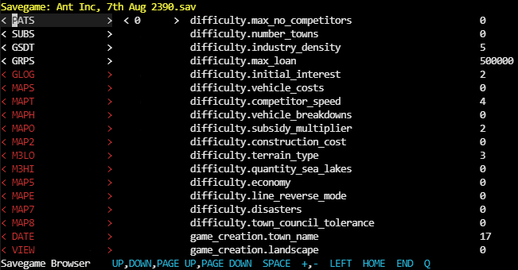

# OpenTTD Savegame Reader

This is a very early version of an OpenTTD Savegame Reader.

It depends on a new savegame iteration which prefixes all chunks with a header.
Chunks that do not have a header, are reported as `unsupported`.

## Installation

```bash
python3 -m venv .env
.env/bin/pip install -r requirements.txt
```

## Usage

### CLI-based interactive view

```bash
.env/bin/python -m savegame_reader <location-of-your-savegame>
```



### Export to JSON

```bash
.env/bin/python -m savegame_reader --export-json <location-of-your-savegame>
```
