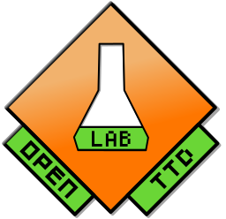

# Summary

OpenTTD [@openttdteam2004openttd] is a business simulation game created for recreational play, where one or more human players build commercial companies by constructing a transportation network of buses, trains, planes, and ships for use in moving passengers and cargo. OpenTTD can be extended by allowing autonomous so-called AI players written using the Squirrel programming language, and OpenTTDLab leverages this capability to allow researchers to run experiments using their own AIs. Doing so converts OpenTTD from a game into a system for researching algorithms and their effects on companies and supply chains, and helps to ensure the results of such research are reproducible.

{height="100pt"}

# Statement of need

OpenTTD is remarkably flexible: its AI system has been successfully used to research A*-based pathfinding [@lakomy2020railroad; @rios2009trains; @wisniewski2011artificial], genetic algorithms [@bijlsma2014evolving], Monte Carlo tree search (MCTS) [@konijnendijk2015mcts], fuzzy decision strategies [@volna2017fuzzy], and anomaly detection [@beuneker2019autonomous]. However, OpenTTD does not include the capability to easily repeat experiments over ranges of configuration--unsurprising given it was created for recreational play--and much of the existing research is correspondingly not reproducible [@charemza2024reusable]. OpenTTDLab addresses this by providing a framework through which experiments similar to those in the literature can be easily run via writing and running Python code, and encourages such code to be shared so future researchers can easily reproduce results.

There are no other open source frameworks that take a simulation game created for recreational play and convert it into a reusable simulator for reproducible research; in this respect OpenTTDLab is novel. The closest equivalent is Axelrod [@knight2016open], a Python framework for researching strategies for playing the Iterated Prisoner's Dilemma. Similar to OpenTTDLab, Axelrod was created in response to difficulties in reproducing existing research.

# Usage and results

Through a single Python function call, OpenTTDLab runs OpenTTD over a range of configurations, such as a range of random seeds and a range of parameters of an AI. It then returns data from every month of in-game time, which can be processed and visualised. \autoref{fig:example-results} shows example results: comparing how the distributions of money in the bank change over time for two configurations of a simple AI. The differences in the distributions show that OpenTTDLab can be used to investigate risk-benefit trades-offs in supply chains.

![How the distribution of money in the bank changes over in-game time for an AI programmed to construct a single bus route with a configurable number of buses [@charemza2024parameterised]. The results of 100 runs of OpenTTD are shown, 50 when the AI is configured to build 1 bus, and 50 for when it is configured to build 16 buses. Adapted from [@charemza2024reusable, chap. 5].\label{fig:example-results}](example-results-charemza2004reproducible.pdf){height="150pt"}

# Acknowledgments

OpenTTDLab could not have been created without the incredible work of all the [contributors to OpenTTD, its dependencies, and forebears](https://github.com/OpenTTD/OpenTTD/blob/master/CREDITS.md). A further thank you to Patric Stout, a.k.a. TrueBrain, who originally wrote the OpenTTD savegame parser that OpenTTDLab forked from. Finally, thank you to Michael Herrmann, whose invaluable supervision of the current author's dissertation [@charemza2024reusable] resulted in the first versions of OpenTTDLab.

# References
